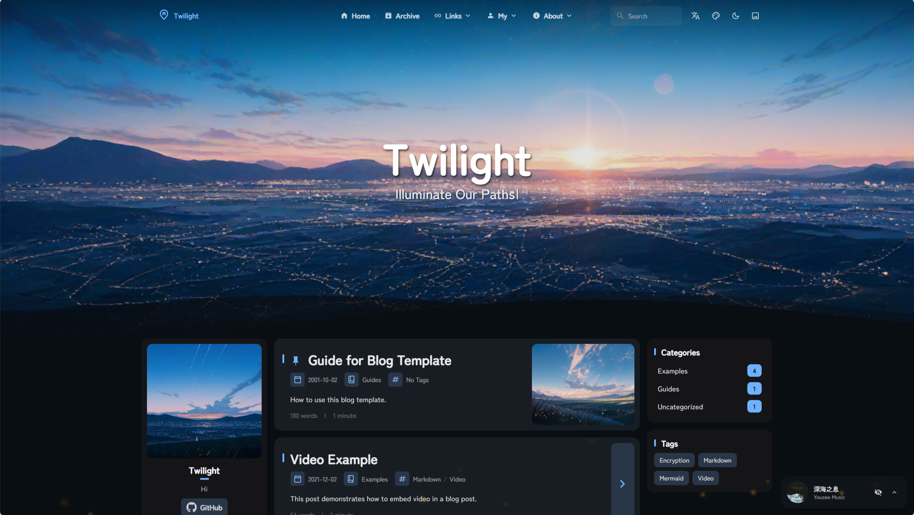

<div align = "center">

# Twilight

<table style="width: 100%; table-layout: fixed;">
   <tr>
      <td colspan="5"></td>
   </tr>
   <tr>
      <td></td>
      <td></td>
      <td></td>
      <td></td>
      <td></td>
   </tr>
</table>

A CMS integrated static blog template built with [Astro](https://astro.build) framework.

[](https://www.bilibili.com/video/BV18VsUzNEmL)&nbsp;
[](https://www.youtube.com/watch?v=VVEiOK8WAK0)

[**🖥️ Live Demo**](https://twilight.spr-aachen.com)
[**📝 Documentation**](https://docs.twilight.spr-aachen.com/en)

English | [**中文**](docs/README_ZH.md)

</div>

---

## 📦 Installation

1. **Clone the repository:**
   ```bash
   git clone https://github.com/Spr-Aachen/Twilight.git
   cd Twilight
   ```

2. **Install dependencies:**
   ```bash
   # Install bun if not already installed
   curl -fsSL https://bun.sh/install | bash
   
   # Install project dependencies
   bun install
   ```

3. **Configure your blog:**
   - [Customize blog settings](https://docs.twilight.spr-aachen.com/en/config/core) inside `src/config.ts`
   - [Support CMS functionality](https://docs.twilight.spr-aachen.com/en/config/cms) inside `.env`
   - [Support Umami analytics](https://docs.twilight.spr-aachen.com/en/config/analytics) inside `.env`
   - [Update site information](https://docs.twilight.spr-aachen.com/en/config/data) inside `src/data`

4. **Start the development server:**
   ```bash
bun dev
   ```


## 🚀 Deployment

Deploy your blog to any static hosting platform


## ⚡ Commands

| Command                    | Action                                  |
|:---------------------------|:----------------------------------------|
| `bun install`              | Install dependencies                    |
| `bun dev`                  | Start local dev server                  |
| `bun build`                | Build production site to `./dist/`      |
| `bun preview`              | Preview build locally before deployment |
| `bun check`                | Run Astro error checking                |
| `bun format`               | Format code with Biome                  |
| `bun lint`                 | Check and fix code issues               |
| `bun new-post <filename>`  | Create a new blog post                  |
| `bun astro ...`            | Run Astro CLI commands                  |


## 🙏 Acknowledgements

- Based on the original [Fuwari](https://github.com/saicaca/fuwari) template
- Inspired by [Yukina](https://github.com/WhitePaper233/yukina) & [Mizuki](https://github.com/matsuzaka-yuki/Mizuki) templates
- CMS functionality powered by [astro-decap-cms-oauth](https://github.com/dorukgezici/astro-decap-cms-oauth)
- Translation functionality powered by [translate](https://gitee.com/mail_osc/translate)